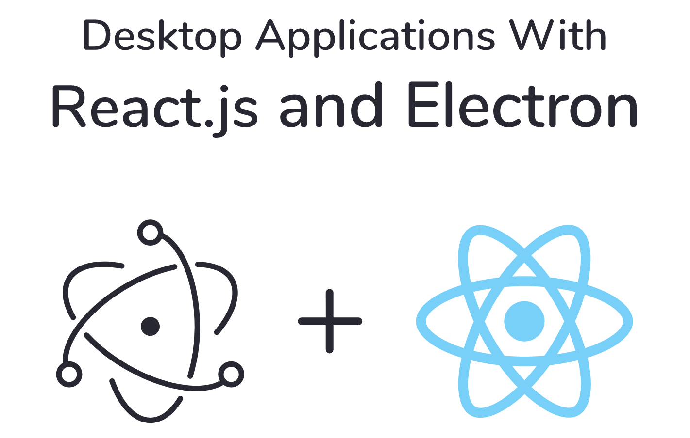

<div align="center">

</div>
<br />
The boilerplate typescript template to get started creating Cross-platform Desktop Apps with Electron and React.
<br />
<br />

## TLDR

Click **Use this template** to create a new repo and start coding.

## Prerequisites

Before starting this tutorial, make sure you have the following tools installed on your system:

1. Node.js (version 12 or newer)
1. npm or yarn (npm is bundled with Node.js, and yarn can be installed separately)
1. A code editor (e.g., Visual Studio Code)

## Step 1: Set up the project structure

Create a new directory for your project and navigate to it in your terminal:

```bash
mkdir react-electron-app
cd react-electron-app
```

Next, create the following directories and files to set up the project structure:

```bash
mkdir -p src electron public
touch src/App.tsx src/index.tsx electron/main.ts
touch public/index.html
```

Your project should now have the following structure:

```
react-electron-app
├── electron
│   └── main.ts
├── public
│   └── index.html
└── src
    ├── App.tsx
    └── index.tsx
```

## Step 2: Initialize the project

Run the following command in the terminal to initialize the project with a `package.json` file:

```sh
npm init -y
```

## Step 3: Install dependencies

Install the necessary dependencies for the project:

```sh
npm install --save react react-dom typescript electron
npm install --save-dev concurrently electron-builder electron-is-dev wait-on cross-env
```

## Step 4: Configure TypeScript

Create a `tsconfig.json` file in the root of the project:

```bash
touch tsconfig.json
```

Add the following content to the `tsconfig.json` file:

```json
{
  "compilerOptions": {
    "target": "ES2023",
    "lib": ["dom", "dom.iterable", "esnext"],
    "allowJs": true,
    "skipLibCheck": true,
    "esModuleInterop": true,
    "allowSyntheticDefaultImports": true,
    "strict": true,
    "forceConsistentCasingInFileNames": true,
    "noFallthroughCasesInSwitch": true,
    "module": "esnext",
    "moduleResolution": "node",
    "resolveJsonModule": true,
    "isolatedModules": true,
    "noEmit": true,
    "jsx": "react-jsx"
  },
  "include": ["src"]
}
```

## Step 5: Set up the React app

Replace the contents of `src/App.tsx` with the following code:

```tsx
function App() {
  return (
    <div className='App'>
      <p>
        Hello World!
      </p>
    </div>
  );
}

export default App;
```

Replace the contents of `src/index.tsx` with the following code:

```tsx
import React from 'react';
import ReactDOM from 'react-dom';
import App from './App';

ReactDOM.render(
  <React.StrictMode>
    <App />
  </React.StrictMode>,
  document.getElementById('root')
);
```

Replace the contents of `public/index.html` with the following code:

```html
<!DOCTYPE html>
<html lang="en">
  <head>
    <meta charset="UTF-8" />
    <meta name="viewport" content="width=device-width, initial-scale=1.0" />
    <title>React-Electron App</title>
  </head>
  <body>
    <div id="root"></div>
  </body>
</html>
```

## Step 6: Set up the Electron main process

Replace the contents of electron/main.ts with the following code:

```ts
import { app, BrowserWindow } from 'electron';
import * as path from 'path';
import * as isDev from 'electron-is-dev';

function createWindow() {
  const win = new BrowserWindow({
    width: 800,
    height: 600,
    webPreferences: {
      nodeIntegration: true,
    },
  });

  win.loadURL(
    isDev
      ? 'http://localhost:3000'
      : `file://${path.join(__dirname, '../build/index.html')}`
  );

  win.webContents.openDevTools();
}

app.whenReady().then(createWindow);

app.on('window-all-closed', () => {
  if (process.platform !== 'darwin') {
    app.quit();
  }
});

app.on('activate', () => {
  if (BrowserWindow.getAllWindows().length === 0) {
    createWindow();
  }
});
```

## Step 7: Configure scripts in package.json

Open your `package.json` file and update the scripts section to include the following:

```json
"scripts": {
  "start": "react-scripts start",
  "build": "react-scripts build",
  "eject": "react-scripts eject",
  "electron:dev": "concurrently \"cross-env BROWSER=none yarn start\" \"wait-on http://127.0.0.1:3000 && tsc -p electron -w\" \"wait-on http://127.0.0.1:3000 && tsc -p electron && electron .\"",
  "electron:build": "yarn build && tsc -p electron && electron-builder",
  "electron:dist": "yarn build && tsc -p electron && electron-builder --mac --dir"
}
```

These scripts will allow you to run the React app in development mode, build the app for production, and package the Electron app for distribution.

## Step 8: Run the application

You're now ready to run your React-Electron application in development mode. In the terminal, run:

```
npm run electron:dev
```

This command will start the React development server, compile the Electron main process, and launch the Electron app. You should see a new window with your "Hello World!" message displayed.
