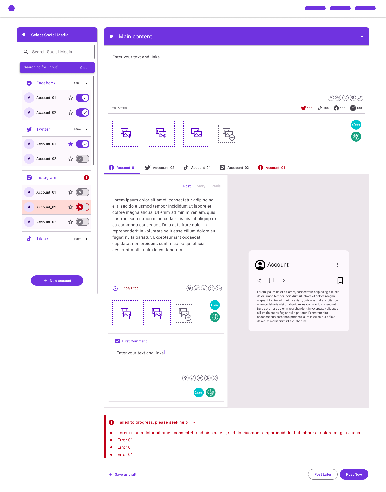

  <a href="#1-catálogo-de-pets-personalizado">
    <picture>
      <source media="(prefers-color-scheme: dark)" srcset="https://camo.githubusercontent.com/4678ce4f354721b2fc6f9d212bb7acd2d1c582494db1ca6cd7da2a1e84b6bcfa/68747470733a2f2f692e696d6775722e636f6d2f6a7147436848722e706e67">
      
    </picture>
    <h1 align="center">OctoPost: Aplicativo All-in-One para Redes Sociais</h1>
  </a>

[**Junte-se a nós na DevHatt e transforme sua paixão por tecnologia em impacto real!**](https://discord.gg/devhatt)

## Índice

- [Projeto](#projeto)
  - [Recursos](#recursos-principais)
- [Como rodar](#como-rodar)
- [Tirar Dúvidas](#tirar-dúvidas)
- [Como Contribuir](#como-contribuir)
- [Regras](#regras)
- [Redes Sociais](#redes-sociais)

## **Projeto**

Bem-vindo ao OctoPost!

O OctoPost é um aplicativo de redes sociais inovador que permite aos usuários fazerem publicações em várias plataformas de mídia social, tudo dentro de uma única e intuitiva interface unificada.

Foi projetado para simplificar o processo de compartilhamento de conteúdo em várias redes sociais. A arquitetura modular do aplicativo permite a adição de novas plataformas de mídia social por meio de módulos personalizados.

### **Recursos Principais**

- **Interface de Publicação Unificada:** O OctoPost fornece uma interface perfeita para compor e compartilhar publicações em diferentes plataformas de mídia social, tudo em um único lugar.

- **Arquitetura Modular:** Desenvolvedores da comunidade podem criar e integrar módulos para novas redes sociais, expandindo a compatibilidade do aplicativo ao longo do tempo.

- **Gestão Simplificada:** Não é necessário alternar entre vários aplicativos - o OctoPost reúne todas as suas mídias sociais em um só lugar, simplificando o gerenciamento de suas contas.

[Figma Layout](https://www.figma.com/file/peiX1rvJum4D1RV99Fchqw/Layout-Octo?type=design&node-id=54395-66&mode=design)

## Como rodar

1. Instalar as dependências: **`pnpm install`**
2. Iniciar o aplicativo: **`pnpm start`**
3. Instalar as extensões:

- [Octopost Extension Pack](https://marketplace.visualstudio.com/items?itemName=DevHat.octopost-extension-pack)
- [**`ESLint`**](https://marketplace.visualstudio.com/items?itemName=dbaeumer.vscode-eslint)
- [**`Stylelint`**](https://marketplace.visualstudio.com/items?itemName=stylelint.vscode-stylelint)
- [**`Prettier`**](https://marketplace.visualstudio.com/items?itemName=SimonSiefke.prettier-vscode)

## Tirar Dúvidas

- **Canal de Help no Discord:** Para dúvidas sobre o projeto utilize o [nosso chat do projeto](https://discord.com/channels/1032763359835213954/1137214858346119209).
- **Salas Interativas:** Prefere uma interação mais direta? Junte-se a qualquer sala aberta no Discord e converse com outros membros que podem ajudar com suas dúvidas em tempo real.
- **Plantões de Dúvidas:** Organizamos sessões especiais em horários determinados onde mentores estão disponíveis para ajudar com questões mais complexas.
- **One-a-One:** Você também pode marcar um 1:1 com o mentor do projeto.
- **Daily:** Se a sua dúvida for algo rápido, você também pode tirar suas dúvidas durante a daily.

## Como Contribuir

1. **Escolha uma Issue:** Explore nossa [lista de issues](https://github.com/devhatt/octopost/issues) e escolha uma que mais te agradar
2. **Siga o nosso Fluxo de Issues**: Verifique nosso [Fluxo de Issues](./docs/FLOWISSUE.md)
3. **Siga nossas diretrizes de Contribuição:** Verifique nossas [Diretrizes de contribuição](./docs/CONTRIBUTING.md)
4. **Siga a Guia de Estilo do projeto:** Verifique a [Guia de estilo](./docs/STYLEGUIDE.md) desse projeto

[Comece sua jornada com a DevHatt agora!](https://discord.gg/devhatt)

## Regras

Para garantir um ambiente saudável, respeitoso e receptivo, toda boa comunidade precisa de regras. Nossa equipe de moderação conta com o respaldo dessas regras, as quais foram criadas para tomar as providências cabíveis em cada situação. Este é um trabalho constante, pois frequentemente atualizamos nossas regras de convivência para enfrentar novos problemas que podem surgir. Por isso, é crucial reservar alguns minutos para ler sobre todas elas e, de tempos em tempos, voltar aqui para acompanhar as atualizações.

Para melhorar as regras, não as explore; em vez disso, nos reporte. Caso haja exploração de alguma falha, a atualizaremos imediatamente, e as regras se aplicarão ao caso, mesmo que tenha ocorrido antes da atualização. Contamos com a colaboração de todos para evitar incentivos ao mau comportamento.

É fundamental ressaltar que todas as sugestões são muito bem-vindas! Se tiver alguma, procure diretamente um dos membros da nossa moderação, identificados pelos cargos de Dono do Parquinho 🎠, Hatter 🤠 ou De Capa 🐱‍🏍. Abaixo, você pode conhecer mais detalhes sobre cada uma de nossas regras e quais punições elas geram.

---

### **⚠️ Regras para Convivência Social**

**1. Exercício do Bom Senso**

Pode parecer evidente, mas todas as normas existem para delimitar e enquadrar comportamentos que ultrapassam o bom senso. O exercício do bom senso assegurará que você esteja aderindo às regras em 100% das situações.

**2. Pornografia ou Assédio**

- 🚫 Banimento imediato 🔨

  É terminantemente proibido compartilhar qualquer conteúdo com conotação pornográfica. Não busque brechas na regra, pois ela se aplica a qualquer situação interpretada pela moderação como tal. Da mesma forma, qualquer comportamento que possa ser interpretado como assédio, mesmo subjetivamente, será identificado pela moderação e enquadrado nesta regra.

**3. Discussões sobre Temas Sensíveis**

- 🚫 Punição: 1, 3, 7 dias. (recorrência (3): ban 🔨)

  É proibido totalmente compartilhar imagens, links, menções ou participar de discussões sobre temas políticos, religiosos, assim como debates sobre futebol. Utilize outras plataformas na internet para esse tipo de interação.

**4. Desrespeito e Ofensas**

- 🚫 Punição: 1, 3, 7 dias. (recorrência (3): ban 🔨)

  Seja uma pessoa cortês e empática. Se uma pergunta for feita, responda de maneira respeitosa. Se você não estiver disposto a responder dessa forma, sua resposta não será bem-vinda. Isso inclui comentários, piadas e falas sarcásticas, irônicas ou ofensivas. Lembre-se de que todos começaram de algum lugar, portanto, respeite as dúvidas das pessoas, independentemente do nível delas. Se as ofensas forem direcionadas à moderação, a punição será imediatamente aumentada para 7 dias.

**5. Vocabulário Inadequado**

- 🚫 Punição: 5, 30, 60 (recorrência (3): ban 🔨)

  Utilize um vocabulário apropriado. Palavrões e termos ofensivos serão moderados automaticamente.

**6. Afiliados**

- 🚫 Punição: 1, 3, 7 dias. (recorrência (3): ban 🔨)

  O compartilhamento de links de afiliados não é permitido. Isso polui nosso ambiente e incomoda muitas pessoas.

**7. Venda e Comercialização**

- 🚫 Punição: 1, 3, 7 dias. (recorrência (3): ban 🔨)

  Anunciar ou negociar a venda ou troca de produtos físicos ou digitais na comunidade não é permitido. Em caso de uma operação que ocorra antes da intervenção da moderação e resulte em prejuízo para qualquer parte, não nos responsabilizamos.

**8. Outras Comunidades**

- 🚫 Punição: 5, 30, 60 (recorrência (3): ban 🔨)

  O compartilhamento de links para outras comunidades no Discord, WhatsApp, Telegram e outros serviços não é permitido. Também não é permitida a criação de grupos paralelos ou denominados como DevHatt.

## Redes sociais

- Discord: [https://discord.gg/devhatt](https://discord.gg/devhatt)
- Twitter: [Devhat (@DevHatt)](https://twitter.com/DevHatt)
- LinkedIn: [Devhat (@DevHat)](https://www.linkedin.com/company/dev-hat/)
- Dev.To: [Devhat (@DevHat)](https://dev.to/devhat)
- YouTube: [YouTube (@devhatt-dailies)](https://www.youtube.com/@devhatt-dailies)
- YouTube: [YouTube (@devhatt)](https://www.youtube.com/@devhatt)

Junte-se a nós nesta jornada emocionante de tornar a DevHatt a melhor software house em todo o mundo!
